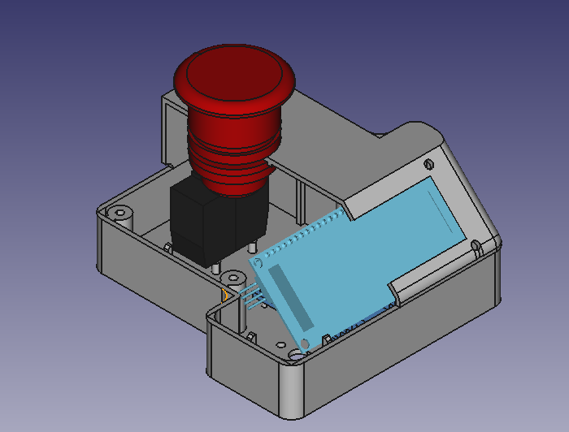
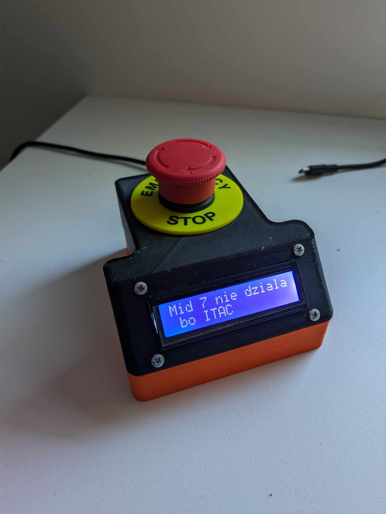
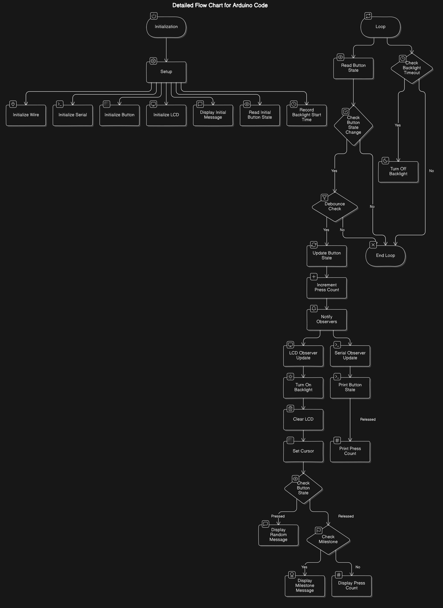

# EmergencyButton

## Purpose
Making this project as a joke, and to practise some design patterns on embedded systems. The end goal is the device that will display a random messeage saying that some device in the factory has been switched off, as well as giving a made up reason why it stoped working.

## Design Patterns
- **Observer Pattern**: Used to handle button state changes and notify observers.
## Components
    - LiquidCrystal_I2C
    - esp32doit-devkit-v1
    - emergency switch 
## Classes and Their Roles
### `Button` 
- Handles button state changes.
- Notifies observers about state changes.
- Manages press count using `Preferences` .
### `GenerateMessage` 
- Base class for message generation.
### `SpecificMessageGenerator` 
- Inherits from `GenerateMessage` .
- Generates random messages based on predefined lists of machines and reasons.
### `LCDObserver` 
- Observes button state changes.
- Updates the LCD display with messages.
- Manages the message to fit the 16x2 display.
- On button realease shows how many times the button was pressed.
### `SerialObserver` 
- Observes button state changes.
- Logs button state changes to the Serial Monitor.
## Key Variables
- `CHUNK_SIZE` : Defines the size of message chunks for display. The message length is set to 16.
- `DISPLAY_TIMEOUT` : Timeout duration for turning off the LCD backlight. timeout is set to 5 seconds.
- `machineList[]` : List of factory devices.
- `reasonList[]` : List of reasons for device shutdown.
## Behavior
- **Button Press**: Increments press count and updates observers.
- **LCD Display**: Shows random messages or press count milestones.
- **Serial Monitor**: Logs button press and release events.
- **Backlight Management**: Turns off the LCD backlight after a specified timeout.
## Setup and Loop
- **Setup**: Initializes components, sets up button and observers, and displays initial message.
- **Loop**: Continuously checks button state and manages LCD backlight based on activity.

